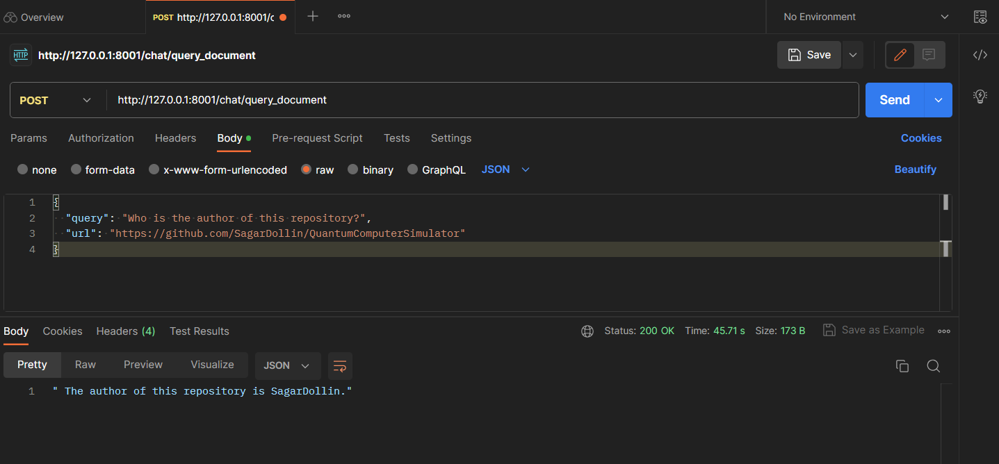

**README**

# ChatBot: OpenAI, langchain, FastAPI Document Query API

**Project Overview:**

Document Query API is a web application that provides an API for querying a document using natural language queries. It includes endpoints for querying a document and a root endpoint to display a server message. The project utilizes environment variables loaded from a `.env` file to store configuration settings like the OpenAI API key.

**Key Features:**

- **Querying a Document:** The API allows users to submit natural language queries along with a document URL. The system processes the query and returns relevant information from the document in response.

- **Environment Variables:** The project utilizes environment variables to store sensitive information like the OpenAI API key. The environment variables are loaded from a `.env` file to keep the configuration secure.

- **Recursive Document Loading:** The project employs the **Langchain Recursive Loader** to load the document URL recursively. This means that the system can efficiently process and handle complex, nested documents by following links and fetching nested content.

**Requirements:**

- Python 3.8 or higher
- FastAPI
- Uvicorn
- Pydantic
- Dotenv
- OpenAI
- Langchain

**Installation:**

1. Clone the repository:
   ```
   git clone <repository-url>
   cd <repository-directory>
   ```

2. Create a virtual environment (optional but recommended):
   ```
   python -m venv venv
   source venv/bin/activate   # On Windows, use 'venv\Scripts\activate'
   ```

3. Install the required dependencies:
   ```
   pip install -r requirements.txt
   ```

**Configuration:**

1. Run the following command to create the .env file:

   ```bash
   python create_env_file.py YOUR_OPENAI_API_KEY
   ```
   Your .env file will look like this
   ```
   OPENAI_API_KEY=YOUR_OPENAI_API_KEY
   server_on_message=Hello, this is the FastAPI server for document querying!
   ```

**Run `test.py` File:**

You can run the tests using the `unittest` test runner. You can run the test.py file without starting the server.
1. Run the `test.py` file using the `python` command:
   ```
   python test.py
   ```

The test script will execute the defined test cases and show the test results.

**Starting the Server:**

To start the server, use the following command in the project's root directory:
```
python server.py
```

The server will run on `http://127.0.0.1:8001`.

**Accessing `/chat/query_document` Endpoint:**

To access the `/chat/query_document` endpoint and query a document, you can use POSTMAN or any other API client.

**Sample Request in POSTMAN:**

- **Endpoint:** POST `http://127.0.0.1:8001/chat/query_document`
- **Headers:** Set `Content-Type` to `application/json`
- **Body:**
  ```
  {
    "query": "Who is the author of this repository?",
    "url": "https://github.com/SagarDollin/QuantumComputerSimulator"
  }
  ```

The above POST request queries the document located at `https://github.com/SagarDollin/QuantumComputerSimulator` with the question "Who is the author of this repository?" The server will process the request and return the response with the relevant information.



Feel free to modify the query and URL in the request to test different document queries using the provided API.


